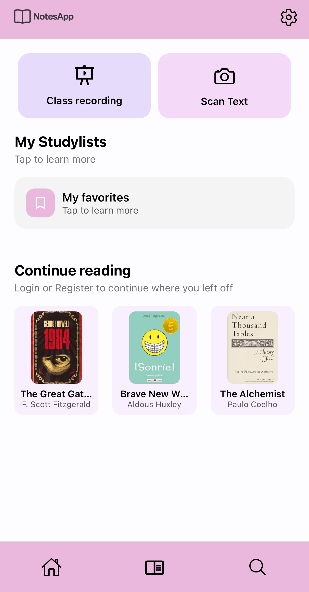
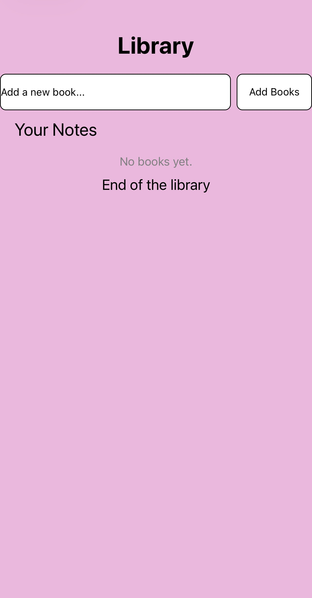
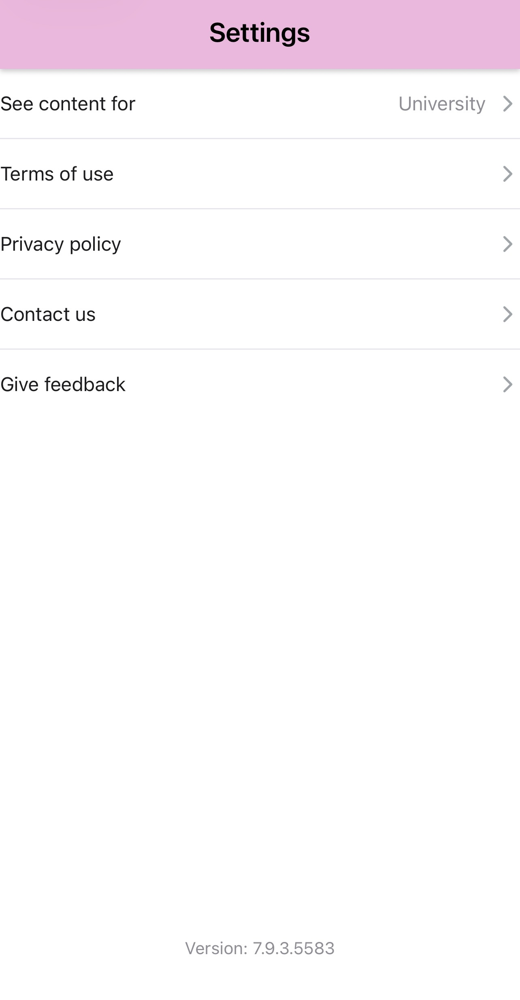

# 📚 Student Notes & Materials App
> Një **prototip fillestar** i ndërtuar me **React Native (Expo)** që demonstron strukturën, navigimin dhe ndërfaqen bazike të një aplikacioni për menaxhimin e librave dhe shënimeve të studimit.

---

##  Çfarë bën ky projekt?

- Mundëson **navigimin midis ekraneve** përmes **Expo Router**.

- Ka **UI funksionale** me përdorimin e komponenteve bazike të React Native.

- Përdor **useState për** ruajtjen lokale të të dhënave (p.sh. lista e librave).

- Shërben si **bazë për zhvillimin e mëvonshëm** të aplikacionit (me backend, p.sh. Firebase).

- Struktura është e organizuar në mënyrë të pastër me folderë si /app, /components, dhe /assets.

---

##  Teknologjitë e përdorura

| Teknologji        | Përshkrimi                           |
|-------------------|--------------------------------------|
| React Native (Expo)     | Platformë për ndërtimin e aplikacioneve mobile cross-platform        |
| Expo Router       | Menaxhimi i navigimit midis ekraneve       |
| React Hooks ( useState )    | Menaxhimi i të dhënave lokale|
| Komponentët bazikë të RN| FlatList, TextInput, TouchableOpacity, SafeAreaView, StatusBar|

---

##  Struktura e projektit

Projekti ndahet në disa skedarë për funksionalitete specifike:

```
📁 StudentsApp/
├── app/
│   ├── _layout.jsx       
│   ├── contactUs.jsx      
│   ├── favorites.jsx      
│   ├── index.jsx       
│   ├── library.jsx    
│   ├── privacypolicy.jsx       
│   ├── search.jsx      
│   ├── seecontentfor.jsx        
│   ├── settings.jsx    
│   └── termsofuse.jsx   
│
├── components/        
├── assets\images      
├── package.json      
└── README.md          
```

---

##  🧭 Ekranet kryesore

🏠 Index (Home)

- Përmban seksione si Class Recording dhe Scan Text.

- Ka pjesën My StudyLists dhe Continue Reading me disa libra të shfaqur për demonstrim.

  
---
📚 Library

- Përdoruesi mund të shtojë libra të rinj përmes TextInput dhe butonit “Add Books”.

- Përdor useState për ruajtjen e listës së librave (pa databazë).

- Shfaq mesazhin “No books yet” kur lista është bosh.

  
---
⏰ Reminder

- Përdoruesi mund të shtojë kujtime të shpejta.

- Lista e kujtimeve shfaqet gjithashtu si kartela me shadow, me mundësi për fshirje.

- Footer mund të rifreskojë ekranin nëse shtypet ikona e Reminder.

  
---
🔍 Search

- Mund të kërkoni libra ose shënime sipas titullit.

- Rezultatet shfaqen si kartela me shadow dhe padding, e ngjashme me Library dhe Reminder.

- Tregon mesazh “No results found” kur nuk ka rezultate.

- Footer mund të rifreskojë ekranin nëse shtypet ikona e Search.

  
---
⚙️ Settings

Përmban lidhje për:
- Terms of Use
- Privacy Policy
- Contact Us
- Give Feedback

   
---
🖌 Stili dhe UI

- Kartelat (cards) përdorin borderRadius: 12–16, shadowColor, shadowOpacity, shadowOffset, shadowRadius, dhe elevation për një efekt modern.

- Input-et dhe butonat gjithashtu kanë rounded corners dhe shadow.

- Të gjitha ekranet kanë Header me logo dhe settings dhe Footer me navigim.

- Dizajni është konzistent në të gjitha ekranet, për eksperiencë uniforme.
---


## Ekipi i zhvillimit

Ky projekt është zhvilluar nga:

- Arijana Braha  
- Diona Sadiku  
- Diell Fazliu  
- Albin Maqastenda  
- Erjon Mustafa  
- Jon Llabjani
---

